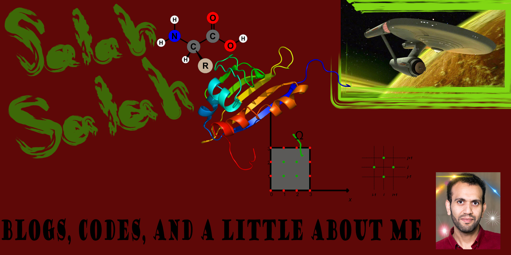

### Hi there 👋
#### 🌱 Fun fact: I’m temporary immortal 
#### ⚡ I’m Looking to collaborate on structural biology
#### 👯 I’m Looking to collaborate on artificial intelligence art
#### ⛰  Rocky mountains enthusiast
#### 💬 I'm fluent in Arabic

<!--
**SalahBioPhysics/SalahBioPhysics** is a ✨ _special_ ✨ repository because its `README.md` (this file) appears on your GitHub profile.

Here are some ideas to get you started:

- 🔭 I’m currently working on ...
- 🌱 I’m currently learning ...
- 👯 I’m looking to collaborate on ...
- 🤔 I’m looking for help with ...
- 💬 Ask me about ...
- 📫 How to reach me: ...
- 😄 Pronouns: ...
- ⚡ Fun fact: ...
-->
